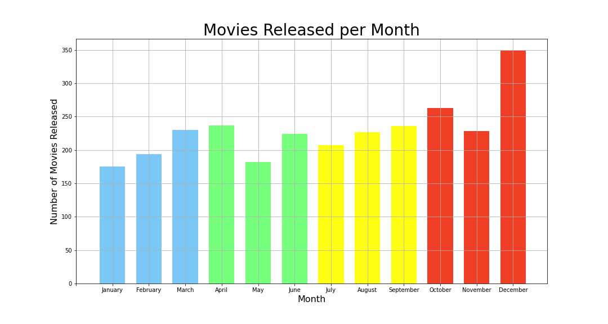

# Microsoft x Hollywood

Author: Simran Kaur

## Overview

This project intends to assist Microsoft produce movies. As Microsoft has no previous movie production experience, they're starting from scratch. A few different analyses were performed. The first analysis was completed on release date and the best time in a year to release to release a movie. A second analysis was done on genres, to determine which genres would be the most profitable for them to start off with. Lastly, a third analysis was carried out on movie runtimes, to produce an industry benchmark. Microsoft can use the findings from this project to succesfully step into the world of Hollywood.

## Business Problem

Microsoft wants to start creating movies however they're unsure of where to start. The movie industry has many variables to it, some being directors, actors, genre, required budget, etc. There are a lot of factors that need to be taken into account before a movie can go into production. Once the movie is made and showcased to the public, only then does revenue start to generate. The main question here is how can Microsoft most strategically enter the market? Some great answers include when to release the movie, which genres would yield the highest return on interest (ROI) and how long the movie should be.

## Data

This analysis uses publically sourced data from thenumbers.com (tn) and well as the IMDb (Internet Movie Database). Specifically, release date, budget, revenue, genre and runtime minutes were the variables mapped together to draw different trends and measures of profitibility.

## Methods

This project uses descriptive analysis to highlight trends in the movie industry. These trends will help Microsoft gauge when to release a movie, the genres with the highest ROI and the ideal runtime for a movie. 

## Results

January has the lowest number of releases and December has the highest. Overall, quarter 1 (highlighted in blue) has the lowest average number of movies released, followed by quarter 2 (highlighted in green), followed by quarter 3 (highlighted in yellow). Quarter 4, which is highlighted in red, has the highest average number of movies released in a year. 

 

Horror movies generate the highest ROI. The second best genere to yield a high ROI is mystery. The third best is thriller, followed by geography, followed by sports. 


By a landslide, the most popular runtime for a movie is between one and one-and-a-half hours to two hours. The least popular runtime is between two-and-a-half hours to three hours. 

 

## Conclusions

This analysis concludes three core recommendations for Microsoft. 

- **The best time to release a movie would be quarter two.** This falls into the months of April, May and June. Quarter two has the second lowest number of releases in a year. Quarter one has the lowest number of releases however, more people are likely to be outside during the spring months.

- **Horror movies have the highest ROI.** Mystery and thriller are good options as well. 

- **The movie runtime should be between 90 minutes and 120 minutes.** This was the runtime range for most of the movies in the dataset. 

### Next Steps

Further analyses can yeild additional ways produce profitable movie:

- **Determing a production budget.** A strong budget is needed to create a high quality movie, which will be directly tied to the success of the movie. 

- **Hire popular actors.** This analysis would get well-known individuals involved and automatically gaining viewers. 

- **Having a strong marketing plan.** This is a major determining factor in the success of a film because if no one is unaware of the movie, there won't be any viewers. 

## Further Information

See the full analysis in the Jupyter Notebook or review this presentation.

For additional information, contact Simran Kaur at simran.kaur@flatironschool.com

## Repository Structure
```
├── Images
│   ├── Genres_With_the_Highest_ROI.png
│   ├── Movie_Releases_Per_Year.png
│   ├── Movie_Runtimes.png
├── zippedData
├── student.ipynb
├── presentation.pdf
└── README.md
```